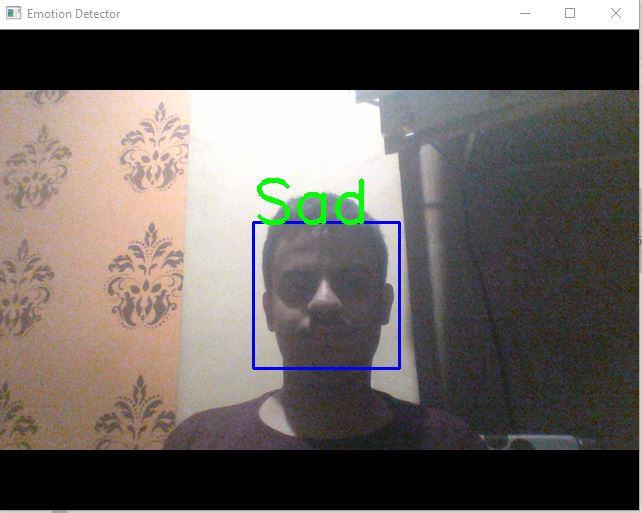

## Facial emotion recognizer  
It's a facial emotion recognizer ,which can classify ypur face into 5 emotions
  
Kaggle Dataset :- https://www.kaggle.com/c/challenges-in-representation-learning-facial-expression-recognition-challenge/data.    
  keras version - 2.2.4
  Tensorflow - 1.14.0  

  
  
